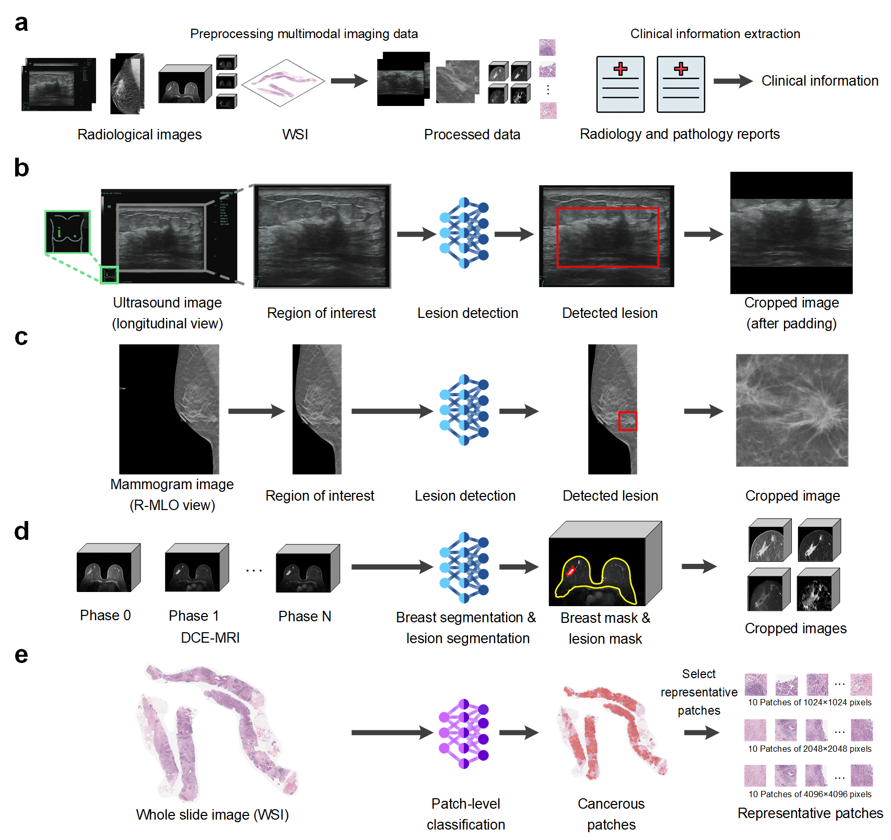
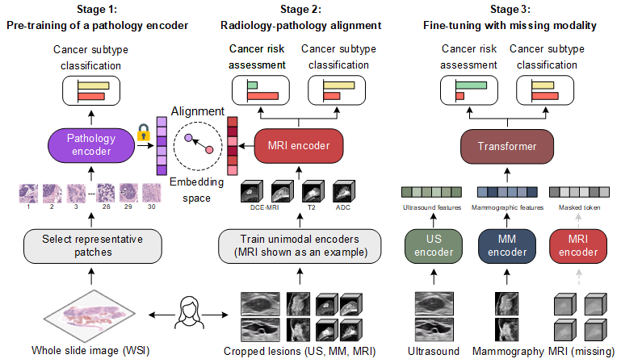

# BINDS: Multimodal Breast Cancer Diagnosis
**Official implementation of: *"A Deep Learning System for Non-invasive Breast Cancer Diagnosis with Multimodal Data"***

### Overview
**BINDS** integrates multimodal data, including **Ultrasound**, **Mammography**, and **MRI** for non-invasive diagnosis.
The repository consists of two main parts:
1.  **Data Preprocessing**: Tools to extract lesion-centered Regions of Interest (ROI) from raw data.
2.  **BINDS**: The core framework for unimodal training and multimodal fusion.

---

## 1. Installation

We recommend creating separate Conda environments for data preprocessing and model training.

### 1.1 Data Preprocessing Environment
```bash
conda create --name data_preprocess python=3.8
conda activate data_preprocess
conda install mamba -n base -c conda-forge
mamba install pytorch==1.11.0 torchvision==0.12.0 torchaudio==0.11.0 cudatoolkit=11.3 -c pytorch
mamba install -c conda-forge openslide openslide-python
pip install -r ./Data_preprocessing/requirements.txt
```

### 1.2 BINDS Training Environment
```bash
conda create --name BINDS python=3.8
conda activate BINDS
conda install mamba -n base -c conda-forge
mamba install pytorch==1.11.0 torchvision==0.12.0 torchaudio==0.11.0 cudatoolkit=11.3 -c pytorch
pip install -r ./BINDS/requirements.txt
```

---

## 2. Data Preprocessing

The primary goal of data preprocessing is to extract ROIs containing lesions from raw clinical images. You can use these scripts to process your own private datasets.

<p align="center">
     <br />
    <em>
    Data preprocessing aims to extract ROIs containing lesions from raw data.
    </em>
</p>

### 2.1 Modality-Specific Workflows
* **Pathology**: Extracts cancerous patches from `.svs` files and selects multi-scale representative patches.
* **Ultrasound**: Employs YOLOv5 to automatically identify and crop 2D ROIs, followed by the selection of two representative images per subject.
* **Mammogram**: Uses YOLOv5 to identify and crop 2D ROIs.
* **MRI**: Converts raw DICOM series into NIfTI format (.nii.gz), followed by automated whole breast and tumor segmentation using [our previously developed AI assistant](https://zenodo.org/records/8059654). Finally, 3D ROIs are extracted from the segmented volumes.

### 2.2 Example Data
Example data and pre-trained weights are available on [Google Drive](https://drive.google.com/file/d/1pGgaVYtlRMwY942hHNbDyAP7dp4lrauP/view?usp=drive_link). Please download and place the `example_data_and_weight` in the corresponding project directories.

---

## 3. BINDS Training & Evaluation

The model training pipeline consists of three primary stages: training the pathology encoder, developing three radiological encoders (incorporating alignment between imaging and pathological features), and performing multimodal fine-tuning.

<p align="center">
     <br />
    <em>
    Overview of BINDS.
    </em>
</p>

### 3.1 Dataset Preparation
Run the following script to partition the dataset:
```bash
python split_dataset.py
```
This will create a `data.json` file used by the dataloaders.

### 3.2 Unimodal Pre-training
Each encoder is trained independently. Setting `opt.alignment = True` enables cross-modal alignment, using pathological features to guide the radiological encoders.
* **MRI**: `python train_mri.py`
* **Mammogram**: `python train_mammogram.py`
* **Ultrasound**: `python train_ultrasound.py`
* **Pathology**: `python train_pathology.py`

### 3.3 Multimodal Fine-tuning
Once the unimodal encoders are pre-trained, perform multimodal fine-tuning:
```bash
python train_multimodal.py
```

---

## 4. Inference & Test

Run scripts in `inference/` and `test/` to evaluate **unimodal**, **bimodal**, and **two-stage** settings.

- `inference/`: generate **predictions**, **modality contributions**, and **attention maps**
- `test/`: compute metrics on the test set.

---

## References

- YOLOv5: [HERE](https://github.com/ultralytics/yolov5)  
- vit-pytorch: [HERE](https://github.com/lucidrains/vit-pytorch/tree/main/vit_pytorch)  
- DINOv2: [HERE](https://github.com/facebookresearch/dinov2)  
- 3D-ResNets-PyTorch: [HERE](https://github.com/kenshohara/3D-ResNets-PyTorch/)  
- AI-assistant for breast tumor segmentation (MRI preprocessing): [HERE](https://zenodo.org/records/8059654)